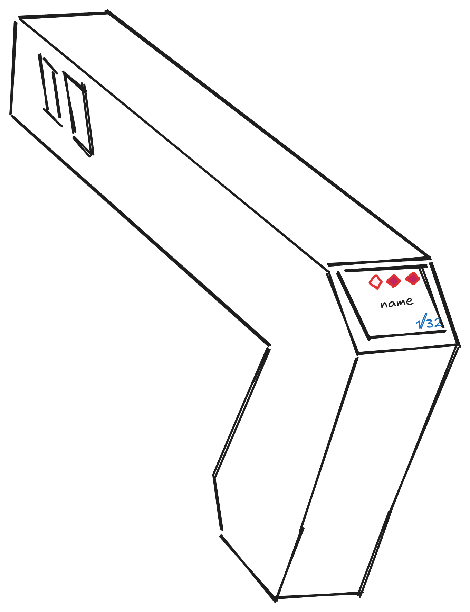

## June 22th: Brainstorming and part listing

Today I started working on my laser gun project. This is my first project on highway and i think it's turning out well.
During the little time that i had today i started searching all the Materials that i would need for the project and i created the project list.
In two days i will start making the 3d part of my project.

**Total time spent: 1.5h**

## June 23th: README.md and Sketch

Today i spent some time on the desing of my diy laser tag gun and i decided to go with a design between reality and sci-fi and i think that my sketch turned out preety good i think that if i have some more time today i will start the 3d modelling. 
A the start of my time i started making a sketch using the suggested platform by Hackclub/highway which is Excalidraw.

I also spent some time on my 3d object and i couldn't finish it but i will tomorrow.
My idea for the 3d model which will hold the arduino Nano the sensors and the battery comes from a toy gun i have. I used this gun to get the rought dimensions and then i started modelling how the acual gun would look like.
As i said before i aimed for a sci-fi and realistic look at the same time. For now i just made the first part of the gun and i will need to refine it tomorrow but for now this is what i could complete today:

To get this result i had to do about 3 tries because at first it wasn't of the rigth dimentions and then i realized that i had to make it empty but i still think that i will need some more tries to get it exactli rigth.

**Total time spent: 4h**

## June 24th: Today 3D editing.

Today i continued yesterday's work by completing the second half of my laser gun. I also cheket that every dimention was rigth because tomorrow i will print prototype with my 3d printer.
In the final version i will order the print from jlpcb and get one in resing.
My project is turning out great.

I started coding and nothing was working properly for two hours so i decided scrapping my code and i restarted and after about twenty minutes i got the base code laid out.
The gun will feature two modes kids mode where the lasers pointers are turned off and the more adult version where the laser pointers are on so you can actually aim.
I created this modes because the lasers if pointed too much time to the eye even if they are not powerfull they could hurt a bit your eyes.

The gun has three states ACTIVE,RELOADING and DEAD. All the players start in ACTIVE state so they can shoot and get hit then if they finish their bullets (depends on game mode) they go in RELOADING state where they can get shot but can't shoot until the gun is reloaded (time depends on the selected game mode). If they are shot during the game they lose one heart and if they loose them all they die.

The game is the last one standing wins and there are going to be three gamemodes:
 - SHOT: where you have infinite bullets but you get only one life.
 - RELOAD: you have three lives but you only have two bullets.
 - HEALED: if you get shot after 15 seconds you can get one heart back but during this time you can't shoot or get shot or the timer will restart. You have 5 lives and 6 bullets.

**Total time spent: 3h and 40 minutes**

## June 25th: Coding.

Today i decided to do the scripting part. I started from yesterday work and i added the game modes i think that tomorrow i will just add the schemaic for the wiring and i will submit my project.
Today i also added support for the screen letting players know of their bullets/health.

**Total time spent: 2h**

## June 26th: Circuit.

Today i decided to do the last part for my project and i drew a circuit diagram. I wrote down every thing where it needs to be connected and to what pin of the components.
I also tried 3d printing the laser-tag-gun but my printer in this period isn't working so i think i will add it to my BOM.csv file as if you had to print it from jl3DP so that all people even ones that don't have a 3D printer can order it in resin.

I hope the circuit diagram is clear :)

**Total time spent: 2.5h**

