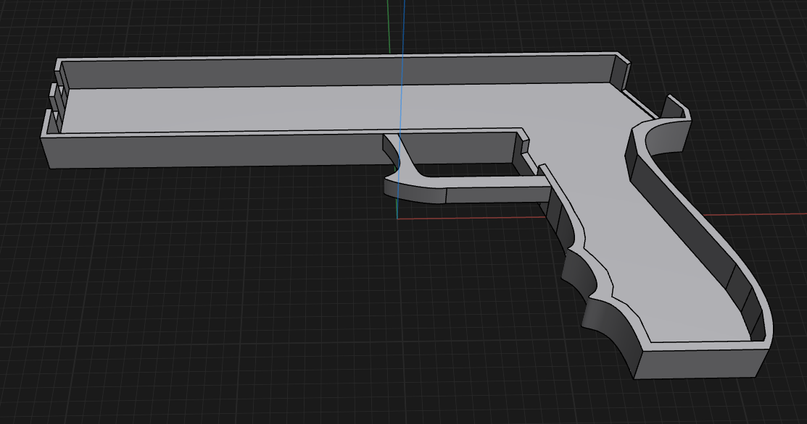

## June 22th: Brainstorming and part listing

Today I started working on my laser gun project. This is my first project on highway and i think it's turning out well.
During the little time that i had today i started searching all the Materials that i would need for the project and i created the project list.
In two days i will start making the 3d part of my project.

**Total time spent: 1.5h**

## June 23th: README.md and Sketch

Today i spent some time on the desing of my diy laser tag gun and i decided to go with a design between reality and sci-fi and i think that my sketch turned out preety good i think that if i have some more time today i will start the 3d modelling. 
A the start of my time i started making a sketch using the suggested platform by Hackclub/highway which is Excalidraw.

I also spent some time on my 3d object and i couldn't finish it but i will tomorrow.
My idea for the 3d model which will hold the arduino Nano the sensors and the battery comes from a toy gun i have. I used this gun to get the rought dimensions and then i started modelling how the acual gun would look like.
As i said before i aimed for a sci-fi and realistic look at the same time. For now i just made the first part of the gun and i will need to refine it tomorrow but for now this is what i could complete today:

To get this result i had to do about 3 tries because at first it wasn't of the rigth dimentions and then i realized that i had to make it empty but i still think that i will need some more tries to get it exactli rigth.

**Total time spent: 4h**

