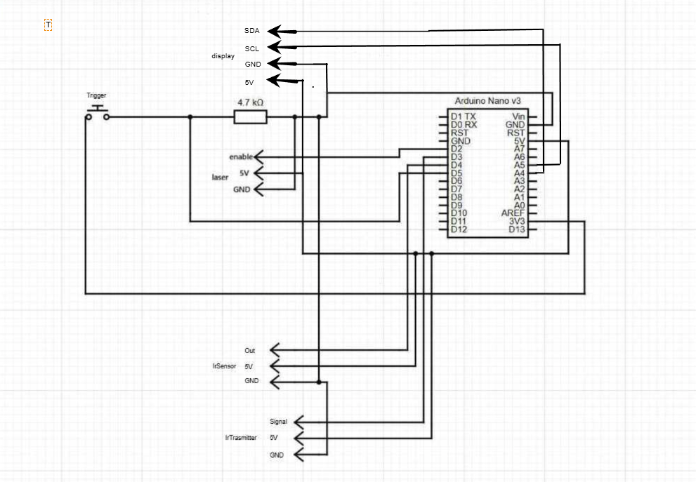

# Arduino-Laser-Tag
In this repository you will find all the files and 3d object that you will need to make your own custom Laser Tag at home and play with your friends!!

## What you will need
For this project all the materials can be found with the links in the BOM.csv file. All the materials cost around 47 € during the sales and when not in sale they cost around 66 €.
The only extra materials that you will need are electric cables and some solder with a soldering iron.

## Build Process
The first thing that you will need is to order all the parts from aliexpress using the links that can be found in the build of materials file(BOM.csv).
Then when all the parts arrived solder the wires to the modules with this wiring:

Then once the Arduino Nano is wired up.
